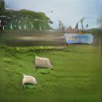
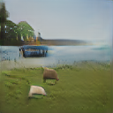
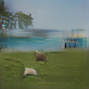

> Our Idea and intuition behind it

Generating images from Scene Graphs is a challenging image generation task, where one wishes to convert a structural information about a scene into an image. In an example provided in the work by Johnson et al. [[sg2im]](https://arxiv.org/pdf/1804.01622.pdf),  
<center>
<br>
</center>
we can clearly observe that traditional text-to-image generation methods struggle to understand complex sentences with many objects. Often, they find it hard to interpret the layout of the scene and the spatial relationships between the objects in the image. This is partly due to the complexity involved in representing the spatial structure through use of natual sentences, which are linear in nature. On the other hand, scene-graph is a stuctured mode of information with high degrees of information condensed into a format, which encodes the spatial relationships between the objects in form of edges of the graph. By inferring the relationships between any pair of objects in the scene, we can get a global understanding of the placement of the objects w.r.t one another. 

> Why Scene Graph as a medium for generating images? 

```
Scene Graph is a more abstract way of representing an image in terms of its semantics, which includes objects, their relationships and attributes, which could make image generation easier without long phrases of text. They are in general a powerful structured representation combining both images and language.
```

Recent techniques leveraged this form of input for several downstream tasks. On the non-generation side they have been successfully used for semantic image retrieval ([SGG](https://openaccess.thecvf.com/content_cvpr_2015/papers/Johnson_Image_Retrieval_Using_2015_CVPR_paper.pdf)), for evaluating image captions ([Spice](https://arxiv.org/pdf/1607.08822.pdf)) and improving ([SPIDEr](https://arxiv.org/pdf/1612.00370.pdf)) image captioning, and converting sentences to scene graphs ([ref](https://nlp.stanford.edu/pubs/schuster-krishna-chang-feifei-manning-vl15.pdf)) and for predicting scene graphs from images ([ref](https://arxiv.org/pdf/1701.02426.pdf)), etc.. . On the image generation side, [sg2im](https://arxiv.org/pdf/1804.01622.pdf), [CanonicalSg2im](https://www.ecva.net/papers/eccv_2020/papers_ECCV/papers/123710205.pdf), [PasteGAN](https://proceedings.neurips.cc/paper/2019/file/12b1e42dc0746f22cf361267de07073f-Paper.pdf), etc .. targeted at improving the image generation using scene graphs, and approaches such as [LayoutTransformer](https://openaccess.thecvf.com/content/CVPR2021/papers/Yang_LayoutTransformer_Scene_Layout_Generation_With_Conceptual_and_Spatial_Diversity_CVPR_2021_paper.pdf), [3D-SLN](https://arxiv.org/pdf/2007.11744.pdf), etc .. aimed at improving the Layout Generation task, which the former methods assumed as an implicit learning task of image generation (i.e intermediate layer). In yet another line of work [SimSG](https://arxiv.org/pdf/2004.03677.pdf) utilized scene graphs as an intermediate stage for editing images. In their pipeline, they convert the input into a scene graph, and then modfiy the scene graph and generate image to obtain edited image. Though image editing has been prevalent for some time ([InPainting](https://arxiv.org/pdf/1604.07379.pdf), [AdvEdit](https://arxiv.org/pdf/1806.01911.pdf), [SemanticInpainting](https://arxiv.org/pdf/1607.07539.pdf), [OMLD](https://arxiv.org/pdf/1908.09521.pdf), ..), SimSG is one of the first attempts to perform the task through scene graphs. 

In almost all of these tasks, the inherent assumption is that the user provides a scene graph which is complete. Upon qualitative evaluation, we have found that this assumption is often strict, i.e without a complete scene graph, the generated images suffer from what we term as *scene inconsistency*. Here is a qualitative example depicting the phenomenon of *scene inconsistency*
<center>

&nbsp;&nbsp;&nbsp;
<br>
</center>
<center>
&nbsp;&nbsp;&nbsp;
<br>
</center>
In the top 2 images, the image on left is provided a scene graph with the object *ocean* missing, and the image on the right is the one where *ocean* is explicitly specified. As we can see, the image generation fails to understand that the *boat* is an object that often collocates with a *water body* and hence needs to *autocomplete* the image with a water body. Instead, it generated *brown soil* and placed the boat on top of it. Similarly in the second row images, the image on the left has all the complete scene graph except the relation *boat, in, ocean*, and the right image has this relation explicitly specified. From these examples, we can deduce that the image generation techniques using scene graphs as inputs are sensitive to the completeness of the scene graph. 

> Our Idea

In this work, we would like to improve the quality of generated images i.e make the scene coherent and natural looking by automatically adding the missing objects and relationships between the objects. Towards this end, we propose a multi-stage pipeline consisting of the following steps
1. Auto completing the input scene graph with possible candidate objects and relations
2. Inferring the explicit layout from expanded scene graph
3. Generating images from the layout obtained from stage 2. 

> Our Contributions

In the proposed multi-stage pipeline, the following are the key contributions: 
- An object encoding framework which automatically predicts the missing objects and relationships in a given scene graph
- A candidate selection module to filter out several unwanted candidates for expansion
- A multi stage framework where we explicitly generate the layout of the image before generating the acutal image, which is implicit in existing methods 
- 

> Why does the idea make sense intuitively?

In an example scene graph, say if we have a scene graph corresponding to two people camping in the forest. Say if the users want to add a node that has a boat near their tent, then just a simple addition of this new node would make the scene unnatural as there is no mention of any water body/coast in the current setting. However, based on the previous scene graphs we have seen, we can easily infer that all instances of boats also had a stream of river/ some other water body nearby, hence that should be added to the scene graph in addition to the boat. Now, when we use this updated scene graph for image generation, the output would most likely be more natural as the simple boat addition scenegraph. We are trying to use the information of what occurs in nature (which is captured by the human-created scene graphs we have) to guide the scene graph manipulation process and eventually the image generation flow. 

