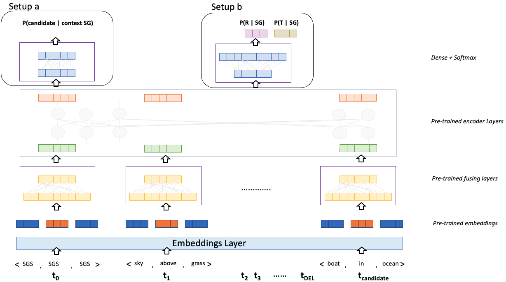

After pre-training the Scene Encoding model, we perform task specific fine-tuning for predicting the missing objects and relations. 

> Setup

Given an incomplete scene graph, our objective is to estimate the missing objects and relationships between the objects. The fine-tuning setup is very similar to the [pre-training](../Pre-training) framework. The input is represented in form of the triples available and the missing elements / triples are represented through masks or by *DEL* separated inputs. The architecture used for the fine-tuning is as follows:

 

The layers of the model are initialized with the learnt parameter values from the pre-training setup. Please note that the image encoder part is entirely removed from this stage because we need to generate the image from here onwards. 

> Fine-tuning setup

The output layers are initialized from scratch. As observed from the figure, there are two setups that we have experimented with. 

<h4>Setup a </h4>
In this setup we assume that a candidate triple is provided to us, and requires us to predict whether it belongs to the input scene or not. For this setup, we construct the input as < SGS, SGS, SGS > , triple 1, triple 2, .. , triple n < DEL, DEL, DEL > candidate triple < DEL, DEL, DEL > i.e scene graph start, input scene graph, delimiter, candidate triple, and delimiter for input end. The output of the final layer corresponding to the token < SGS, SGS, SGS > is passed through a couple of dense and softmax layers to estimate the probability of the candidate triple being part of the input scene graph. 

**Training**  
For training we simulate the incomplete scene graphs by randomly removing some triples from the input scene graphs and consider them as the candidate triples. The positive candidates are taken directly from the removed triples. The negative candidates are either randomly generated by sampling by the object and relation dictionaries or by taking some random triple from other scene graphs. Note that this setup is a binary classification problem and hence the loss function used is the standard cross entropy loss. 
> Challenges 

This setup has a major drawback. The input assumes that a candidate triple is provided and the objective is to classify the triplet. However, in a real world setup, the candidate is not provided to us. Therefore, we consider each < object * relation * object > possible triple from the object and relation dictionaries and evaluate it against the input scene graph. However, we have around 65K objects and 20K relation types in the original Visual Genome dataset, and even in the VG-WSDN dataset we have 150 objects * 50 objects * 150 objects. Given the number of possible candidate triples, there is a possibility of huge amounts of noise and compute requirements for this setup.

<h4>Setup b </h4>
In this setup we assume that a candidate object is provided to us, and we are supposed to predict the missing relation and other end of the triplet. For this setup, we construct the input as < SGS, SGS, SGS > , triple 1, triple 2, .. , triple n, < candidate object, MASK_RELATION, MASK_OBJECT >, < DEL, DEL, DEL > i.e scene graph start, input scene graph, candidate object with other 2 parts masked, and delimiter for input end. The output of the final layer corresponding to the masked elements MASK_RELATION, MASK_OBJECT are passed through a couple of dense and softmax layers to predict the missing relation and tail objects. Important points to consider - 
1. In this setup, the number of times we need to infer from the model is only the number of object times which is much better than the previous setup 
2. The model has the additional burden of performing an n-way relation and object prediction problem which is not present in the previous, hence a drop in performance.
3. While we mask the triple in its original position in the scene graph sequence, since there is no significance to the position in the input order (no position encodings), we always put the candidate at the end during inference time, without loss of generality. 

**Training**  
For training we simulate the incomplete scene graphs by randomly masking relation and tail objects of triples from input scene graphs and try to estimate them. Unlike the previous setting we don't need to generate negative samples. The ground truth labels are the masked elements from the input scene graphs. The loss function is a weighted combination of the 2 multi head n-class classification losses i.e categorical cross entropy losses.
> Challenges 

This setup also has a similar drawback. We need to iterate over the *n* objects in the object dictionary and infer the model n-times which is also a significant inference overhead. To overcome this, we propose a candidate selection/filtering algorithm, which is explained below. 

<h4>Candidate Selection Algorithm</h4>
Our main hypothesis, which is also proven through our pre-training results, is that objects in nature often tend to collocate with each other. Therefore, we adapt a technique called [Pointwise Mutual Information](https://en.wikipedia.org/wiki/Pointwise_mutual_information) to estimate this co-occurrence phenomenon. The PMI is defined as 

 

where obj1 and obj2 are the two objects for which we want to estimate the pmi scores. Intuitively the metric measures the probability of both the objects occurring together as against to both of them appearing individually in the scenes. Here is the pmi scores chart plotted for the 150 objects of the VG-WSDN dataset. 

 

For better visualization, you can also download the image from [here](https://github.com/bhanu77prakash/scene-edit.github.io/blob/main/images/pmi_plot.png). The image is plotted at a very high resolution, please download and zoom in to see the labels and the colors. In the picture lighter regions indicate that they have a high pmi score and darker regions indicate that they have a low pmi score. At a quick glance, we can conclude that the lighter regions are very sparse which also proves that the objects do tend to collocate with each other. 

> Some examples from the pmi chart, the object *toilet* has a very high pmi score with objects *bathroom* and *sink* and has very low pmi score with objects *tower*, *giraffe*, *elephant* etc... 

We use these pmi scores to filter the candidate objects. For a given candidate object, we compute its pmi score with every other object in the given scene graph and take the sum of the pmi scores. We use a threshold hyperparameter to filter out all the unnecessary candidates. 

**Inference**
We consider only the candidates that has pmi score higher than the aforementioned threshold and predict the relation and tail ends. As a further filtering step, we take the overall probability of the prediction as (due to the independence nature of our formulation). 

 

and threshold with another hyperparameter which governs whether the score of the prediction is enough to add the triple to the scene or not. 

Finally we add those triples that cross the threshold parameter back into the scene. 