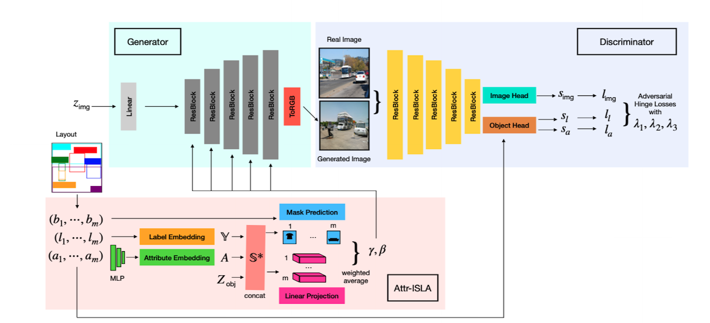

The final stage of our pipeline is the Image Generation module. Its takes as input the layouts generated by the [layout-generation module](../Layout-Generation) and generates a corresponding image. As mentioned in the [related works](../../Related-Work), we use [AttrLostGan](https://arxiv.org/pdf/2103.13722.pdf) for generating the images. The architecture and workings of the method are described below.

 

Given an image layout consisting of a set of objects along with their bounding boxes and object attributes, the goal of the model is to generate a natural looking image with accurately positioned objects according to their bounding boxes, also reflecting their input attributes. The proposed approach first samples latent vectors for the entire image and the individual objects to control the style of the generated image and objects. The latent vectors are sampled from the standard normal distribution. These latent vectors are passed through a ResNet based generator to generated the final image. The generator is also conditioned by the Attr-ISLA module which generates two transformation parameters gamma and beta that incorporates information about the object positions from the bounding boxes and the attributes.

The discriminator consists of three components: a shared ResNet backbone as feature extractor, an image head classifier and an object head classifier. The object-label and object-attribute embeddings are passed to the object head to predict the object-label and object-attribute scores. The final loss calculated as a weighted sum of the adverserial hinge losses on the image, object-label and the object-attribute. The model is trained on the [Visual Genome dataset](../../Datasets). We use the pretrained model weights provided in the [official repository](https://github.com/stanifrolov/AttrLostGAN) to generated the images for our experiments. However, during inference, attributes for the newly added objects to the scene graph might not be available. For those cases, we sample the object-attributes from the Visual Genome dataset.
