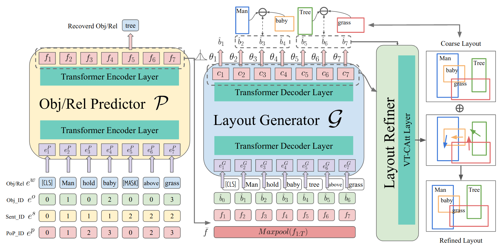

The next step in the process is layout generation from the scene graph. As discussed in the [related works](../Related-Work), instead of directly going from scene graph to image, we make the problem a bit simpler and more structured by first predicting the layout of the image from the scene graph and then generating the image from the layout. For this scene graph to layout generation problem, we have chosen the [LayoutTransformer](https://openaccess.thecvf.com/content/CVPR2021/papers/Yang_LayoutTransformer_Scene_Layout_Generation_With_Conceptual_and_Spatial_Diversity_CVPR_2021_paper.pdf)(LT-Net) architecture.

The following figure ([source](https://openaccess.thecvf.com/content/CVPR2021/papers/Yang_LayoutTransformer_Scene_Layout_Generation_With_Conceptual_and_Spatial_Diversity_CVPR_2021_paper.pdf)) provides a high-level overview of the working of the LayoutTransformer Network.

 

The architecture consists of three main modules: the object-relation predictor, the layout generator, and the layout refiner. The predictor encodes the input scene graph in terms of different semantic attributes and learns contextual features. Next, the layout generator takes in these contextual features and predicts bounding box information for each object. Finally, the layout refiner, which employs a visual-textual co-attention, calculates residuals to the predicted bounding boxes based on attention-alignment between the course bounding boxes and the contextual representation from the predictor to refine the bounding box predictions. Due to this last step of refinement, it is able to generate spatially diverse layouts. The authors trained the above model on COCO-stuff and [VisualGenome-MDSN](../Datasets) datasets and have released the [pre-trained weights](https://drive.google.com/drive/folders/1pPJxX0ih6pgUpKjeIjIICso6SpOGHoaI). For this project, we use the model trained on the VisualGenome-MDSN dataset.

We adapt the code from the official GitHub [repo](https://github.com/davidhalladay/LayoutTransformer). However, the current implementation was not in a working state and had various missing pieces which we added to the code. For example, the code provided in the repository doesn't work directly for VG-MSDN pre-trained model. Our version of the code is added to the LayoutTransforer directory of the submitted GitHub repository.
