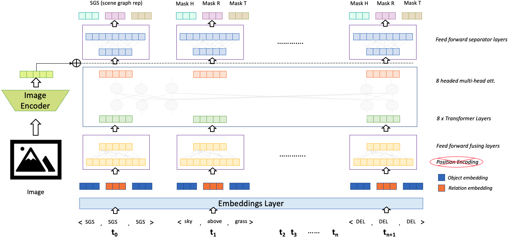

Now lets look into the pre-training stage of the proposed pipeline. To reiterate, our objective is to build a model for automatically predicting the missing objects and relationships from a scene. 
> Key Idea

Our hypothesis is that the naturally occurring objects in the scenes have the so called *co-occurrence* relationship. This means that there is an inherent relationship between the objects that go together in a scene. For example, we often find the object *boat* collocating with the objects *ocean*, *sea*, *lake*, etc.. and the object *sheep* with *grass*, *mountain*, *tree*, etc.. It is unnatural to have a scene where a *boat* is on a *road* (without a water body nearby) or *sheep* is inside a *bus* (again, possible in extreme examples). With this hypothesis in mind, we propose a framework called as *Scene Encoder*, a first approach towards large-scale pre-training of scene information. Here is a complete image of the proposed architecture

 

Our architecture is reminiscent to the transformers architecture. The intuition behind choosing this architecure is the resemblance between objects in a scene and words in a text piece. Similar to "words tend to co-occur with each other", in scenes, "objects tend to co-occur with each other". Therefore, we chose the transformers architecture as the backbone of our model. The different components of the architecture are as follows: 
1. **Input**  
    In contrast to the text setting, the input words doesn't have an "constituent/partial meaning", which restricts us from using standard Word Piece representation or Byte-Pair encoded representations. We represent each triplet in the scene graph (< *object 1, relation, object 2* >) as an input token to the model. However, each of these three parts needs to be encoded independently. Therefore, we represent the head and tail through one-hot encoding *object dictionary*, and the relation using one-hot encoding of *relation dictionary*. Similar to the transformers architecture, we add a Scene Graph Start (*SGS*) and Delimiter (*DEL*) token to mark the start and end of the scene graph. 
2. **Embeddings**  
    We intialize the embedding layers from scratch, and learn two sets of embeddings; one for the objects and the other for the relations. 
3. **<s>Positional Encoding</s>**  
    A key aspect of the original transformers architecture is to encode the position information using sine and cosine functions (to mimic the binary integer positions). However, in the scene graph there is no notion of position (i.e sequentiality), therefore we explicitly remove the position encoding layer. 
4. **Feed Forward Fusion Layer**
    Since the input token is in a triplet format, we need to fuse the information to generate a single token representation. Therefore, we use concatenation and FFN layers to generate a single representation of the triplet. 
5. **Transformer Layers**  
    The next set of layers are the standard Transfomer encoder layers with multi-head attention modules. We do not modify any of these components because each the concept of learning an object representation by attending to the other objects in the scene is quite applicable in our scenario. 
6. **Feed Forward Separator Layers**  
    Since the input is fused from a triplet into a single representation, on the output side, we invert the fusion layers to generate triplet outputs.  

> Pre-Training Procedure

For pre-training, we borrow the concepts from the [BERT](https://arxiv.org/pdf/1810.04805.pdf) model. Similar to the BERT, we perform a large-scale pre-training of the <b> *Masked Element Prediciton* (*MEP*) </b> task. Note that the Next Sentence Prediction task is not applicable here. Given an enoromous number of scene graphs, we randomly mask some of the *elements* of the scene graph and try to estimate the masked elements. Unlike the standard MLM task, we do not mask the entire input token because the head, relation and tail parts of the triplet are independent from each other i.e a relation can be replaced with another relation between the same head and tail objects. Therefore, we perform the following types of masking 
1. We mask the entire triplet randomly with probability p. 
2. Else, we mask each of the elements randomly with probability p.
On the output end, we try to predict the masked input elements. 

During pre-training, for better representation learning, we also concatenate the image embeddings of the scene image obtained by using pre-trained image encoders ([Resnet 18](https://pytorch.org/hub/pytorch_vision_resnet/) in our case) to the final transformer layer outputs. We apply this technique at random and other times we append a padding vector, because during fine-tuning and inferencing time, the image is not available to us up front. The results of the pretraining method are reported in the [Pre-training results](../../Results/Pre-training/) section. For this step, we use 80K images and their scene graphs from the Visual Genome dataset. The loss function is the standard categorical cross entropy loss applied at the masked positions. 