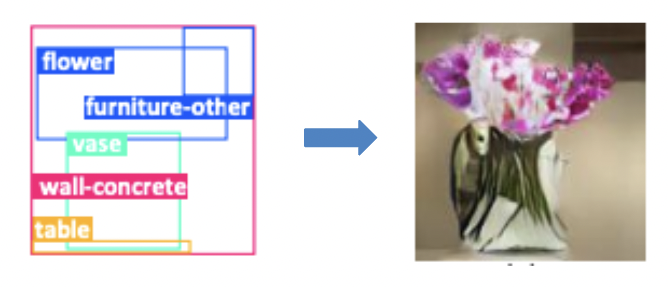

[Scene Graphs](https://arxiv.org/pdf/2104.01111.pdf), are graphical structures that represent scenes as directed graphs where the nodes are the different objects present in the scene and the edges are the relationships that exist between these objects. There are several works that utilize scene graphs for a variety of [vision](https://openaccess.thecvf.com/content_cvpr_2015/papers/Johnson_Image_Retrieval_Using_2015_CVPR_paper.pdf) and [language tasks.](https://arxiv.org/pdf/1607.08822.pdf)

In this project we focus on generating natural images from incomplete scene graphs. Existing works that generate images from scene graphs can be broadly categorized into two approaches. Methods in the  first approach directly generates images from scene graphs in a single stage while the works using the second approach first generates the image layout from the scene graph and then generates the image from the layout. The following subsections outlines varies works that falls under all these categories.

> Scene Graph to Image generation

 

[Johnson et al. [sg2im]](https://arxiv.org/pdf/1804.01622.pdf) was the first work to employ scene graphs to generate images by leveraging Graph Convolutional Networks for generating the intermediate scene layout consisting of object and segmentation masks which is then consumed by a Cascaded Refinement Network to produce the final image.

[Huijuan et al.](https://arxiv.org/pdf/1912.07414.pdf) imporves upon the previous work by learning canonical representations for scene graphs which results in improved image generation for complex scenes.

[Yikang et al.](https://arxiv.org/pdf/1905.01608.pdf) takes as input a scene graph and exemplar object crops to generate the final image. Similar to [sg2im] this work uses Graph Convolutional Networks for processing the scene graphs and Cascaded Refinement Network for generating the images. It further employs crop selector and object refiner to improve the image quality.

In the [results section](../Results/Fine-Tuning), we have provided some qualitative results of using [sg2im] on our proposed approach.

> Scene Graph to Layout generation

 

Scene graph to layout generation is a branch of work that tries to model the geometric properties of the objects and create a sketch of where the objects would be placed relative to each other. Here the input is a scene graph and as output we predict the normalized bounding boxes ( (x_left, y_top, x_right, y_bottom) or (x_center, y_center, width, height) ) for all the objects present on the scene graph.

 [Akash Jyothi et. al.](https://openaccess.thecvf.com/content_ICCV_2019/papers/Jyothi_LayoutVAE_Stochastic_Scene_Layout_Generation_From_a_Label_Set_ICCV_2019_paper.pdf) proposed a variational autoencoder based framework for generating stochastic scene layout given a label set description. Their proposed architecture takes a set of object labels as input and predicts both - the number of instances for each category and the corresponding bounding box information, finally forming the scene layout. 
 
  [Cheng-Fu Yang et. al.](https://openaccess.thecvf.com/content/CVPR2021/papers/Yang_LayoutTransformer_Scene_Layout_Generation_With_Conceptual_and_Spatial_Diversity_CVPR_2021_paper.pdf) introduced LayoutTransformer. Their proposed architecture is a three-stage network that first encodes the different semantic attributes into contextual features, uses a GMM-based model to learn layout-aware representations and predicts bounding box information for the different objects. It finally uses a co-attention-based module to refine the predicted bounding boxes and produce spatially diverse outputs. We use this LayoutTransformer architecture in our experiments.

> Layout to Image generation

 

[Wei et al. [LostGAN]](https://arxiv.org/pdf/1908.07500.pdf) presents a layout and style based architecture for generating images from layouts using GANs. The generator is conditioned using the object bounding boxes and style latent vectors.

[Stanislav et al. [AttrLostGAN]](https://arxiv.org/pdf/2103.13722.pdf) improves upon [LostGAN] by also introducing attributes for the objects present in the layout and conditioning the generator using the same.

[Sen et al.](https://arxiv.org/pdf/2103.11897.pdf) argues that images generated by the existing layout to image generation approaches typically have a broken object-to-object relations and the objects's apprearance is usually distorted. It overcomes this issue by introducing context-aware feature transformation module and Gram matrix based location-sensitive feature maps to improve the quality of the generated images.

In our proposed multi-stage framework, we utilize [AttrLostGAN] as the module for generating the images from the layouts.

> Interactive Image generation

 

[Gaurav et al.](https://arxiv.org/pdf/1905.03743.pdf) proposes a method to generate an image incrementally based on a sequence on scene graphs. It uses Grpah Convolutional Networks for encoding the scene graphs, GANs for generating images and Recurrent Networks for preserving the images generated in each stage.

[Oron et al.](https://arxiv.org/pdf/1909.05379.pdf) presents an interface for the users to place object labels on an image grid, it then automatically infers the scene graph from the image grid to generate the final image. 

[Helisa et al.](https://arxiv.org/pdf/2004.03677.pdf) proposes an approach for image manipulation. It takes a input image and predicts its scene graph. The users can modify the predicted scene graph, after which the method generates a new image conditioned on the initial image. The method uses a [Subgraph-based Framework](https://arxiv.org/pdf/1806.11538.pdf) for generating the scene graph and uses cascaded refinement networks to generate the images.

All of these works, require explicit human involvement at multiple stages and expect a complete scene graph to generate the images. We try to overcome these limitations in this project by proposing a novel scene graph completion module. 