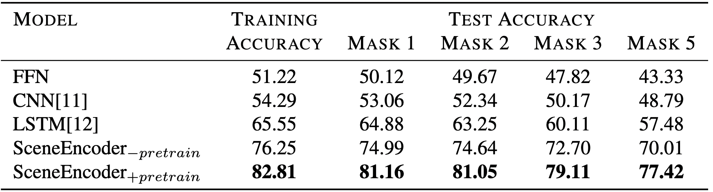
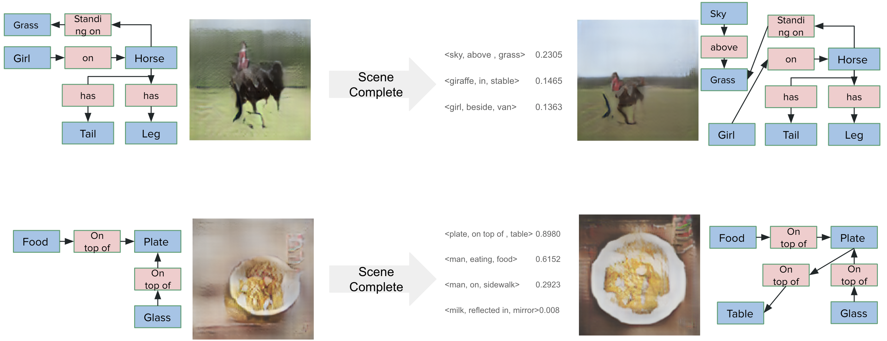
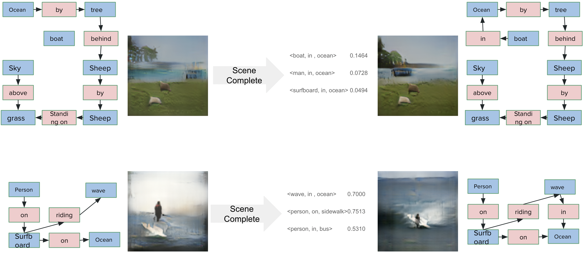

For the fine-tuning task, we take the subset VG-WSDN dataset which is constructed by taking 150 most frequent objects and 50 most frequent relations. As mentioned in the [methodology](../../Methodology/Fine-tuning) section, we have experimented with 2 setups for fine-tuning.

In **setup  a** (binary classification of candidate triple), the results obtained are as follows. 

 

To the best of our knowledge, the scene autocompletion task hasn't been attempted before. Therefore we implement some of the baselines on our own. We replace the proposed transformer based architecture with its simple counterparts, Feed Forward Neural network, CNN, LSTM. We also compare the performance of the proposed Scene Encoder with and without pretraining stage. The best results are observed with the Scene Encoder model with the pre-train - then fine-tune paradigm. 

Since we have balanced the dataset by using negative subsampling approach (to add equal number of negative instances), the accuracy metric is a true indicator of performance in our setting. The training procedure for **setup  a** is described in the [methodology](../../Methodology/Fine-tuning) section and the first column indicates the accuracy during the training. 

The 2nd - 5th columns report the results of various levels of masking the input. We randomly remvove 1, 2, 3, and 5 triples from the scene graph and try to predict them. The accuracy obtained in these setups are mentioned in the table. As we can observe, more and more triples missing from the input scene graph led to decreased performance, which is expected. However, the peformance drop is not drastic when 5 triples are masked when compared to masking one triple. 

Here are some of the qualitative resutls obtained by passing the expanded scene graphs to the pre-trained [sg2im vg-128](https://github.com/google/sg2im) model. 

 

 

In each example, the image on the left is the scene graph with 1 missing triple, middle portion is the predicitions from the above fine-tuning setup, and the right part is the generate image with its expanded scene graph plotted. Trivial objects like *sky*, *table*, *boat in ocean*, and *wave in ocean* seemed to improve the image generation process. 

For the **setup b**, the results are as follows

<table style="width:500px;">
    <tr>
        <th>Mode</th>
        <th>Relation Accuracy</th>
        <th>Object Accuracy</th>
    </tr>
    <tr>
        <td>Test</td>
        <td>59.15</td>
        <td>53.18</td>
    </tr>
</table>

