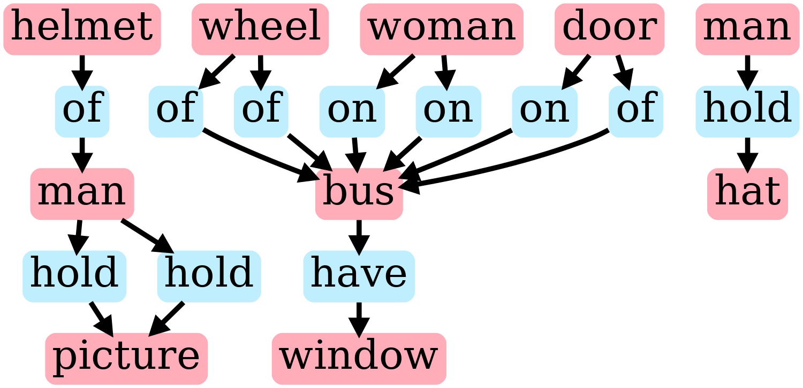
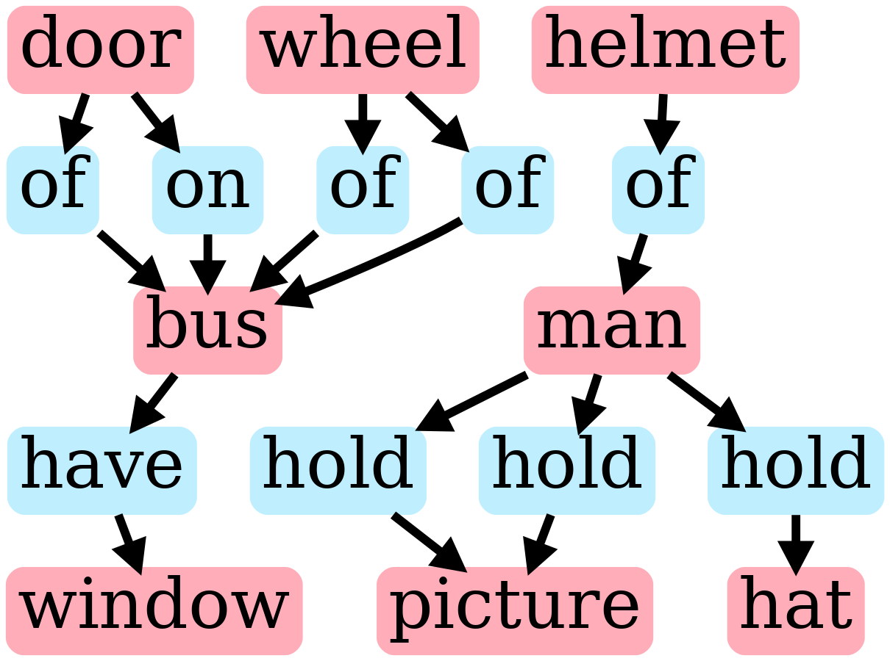
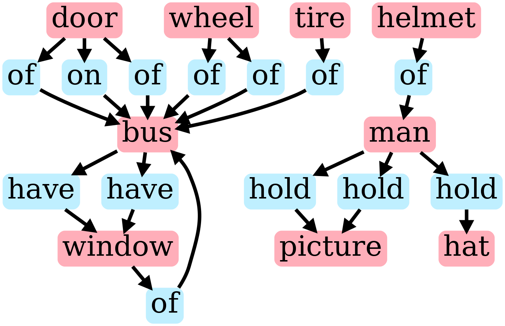
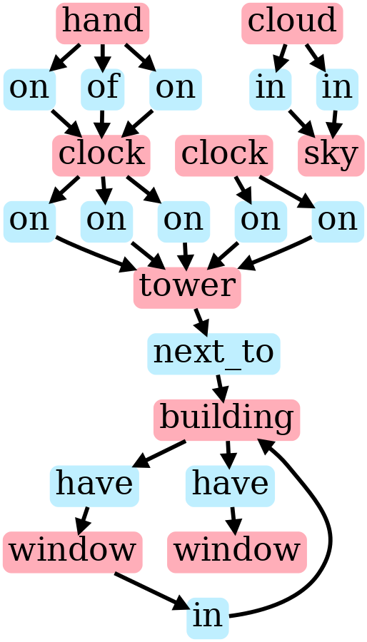
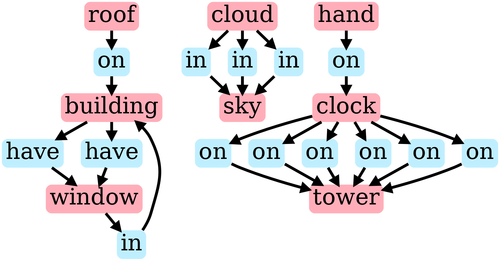

In this section, we compare the layouts generated from the ground truth scene graph, the missing scene graph, and the predicted scene graph. To quantitatively compare the performance of the layout generation module, we use the [mIoU](https://pyimagesearch.com/2016/11/07/intersection-over-union-iou-for-object-detection/) (mean Intersection over Union) score between the ground truth bounding boxes available with the visual genome dataset and the predicted bounding boxes from the layout model as the metric for comparison. The table below compares the performance of the layout generated from the 3 types of scene graphs compared-

| **Scene graph type** |       **mIoU**      |
|:--------------------:|:-------------------:|
|    GroundTruth SG    |  0.2605072272175019 |
|      Missing SG      | 0.23740863438627663 |
|     Predicted SG     |  0.2340785063244288 |

As we see from the results above, the trend is not quite what we expected. Ideally, we would have expected the GroundTruth SG to give the highest mIoU score, followed by the Predicted SG and Missing SG coming the last. But here, the order of Predicted and Missing seems reversed, though only by a small amount. We investigated further why this might be happening. To do so, we looked at a few examples and tried to follow them from scene graph generation to layout generation and finally iou calculation. We observed that many a times, our model adds a new object to make the scene graph look more realistic, but that object is not present in the ground truth scene graph, hence it has no associated ground truth bounding box information. Due to this, it doesn’t contribute to the IoU score and it might happen that rather the number of objects in GT exactly matches the number of objects in the missing scene graph, which leads to better overlap score for the latter. Let's look at a few examples:

**Edge case example 1**

GroundTruth scene graph:

 

Missing scene graph:

 

Predicted scene graph:

 

We note that our model decided to add a tire to the scene graph, which intuitively makes sense given the rest of the scene, but that was a new object not present in the ground truth, hence IoU might not be the correct metric to show the efficacy of our method, rather the FID scores of the generated images would give a better sense of the advantages of our method, which would be discussed in the next section.

Let's have a look at another example showcasing this issue:

**Edge case example 2**

GroundTruth scene graph:

 

Missing scene graph:

 

Predicted scene graph:

 

Here too our model predicted a roof over the building, which makes complete sense given the scene, but that object wasn't present in the ground truth information and hence doesn't contribute to IoU score.

To overcome the above issue and have a logical comparison, we sample test set examples where the new objects added in the predicted scene graph from the missing scene graph by our model are present in the ground truth data. The table below presents the mIoU scores for the three settings on the test set sampled this way-

| **Scene graph type** |       **mIoU**      |
|:--------------------:|:-------------------:|
|    GroundTruth SG    | 0.33970117290496266 |
|      Missing SG      |  0.2674509629495256 |
|     Predicted SG     |  0.2835906955093295 |

We observe that the values follow the trend as expected. But as we have noted in this section, mIoU might not be the correct metric for the problem at hand. Intuitively it would make more sense to compare the quality and naturalness of the images generated by our Predicted scene graph. This is done in the section below. 
