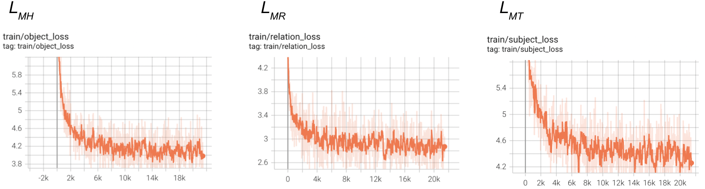
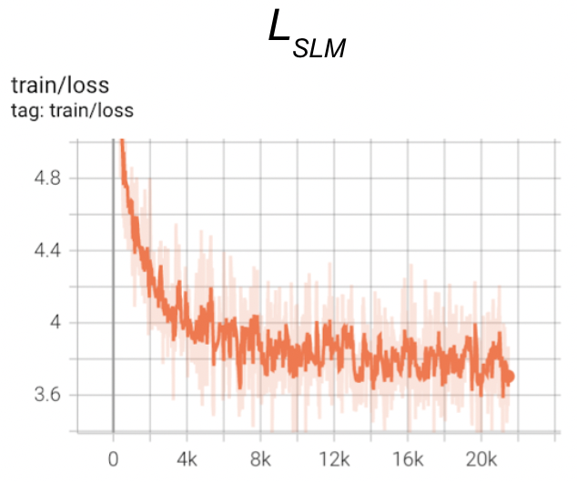
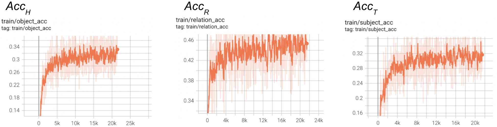

For the pre-training stage, we have taken 80K images and their scene graphs from the original Visual Genome dataset and trained using the *MEP* setup explained in the [pre-training methodology](../../Methodology/Pre-training) section. We have a total of 2,315,906 triples from these scene graphs. The objective that is trained on is 

 

During the pre-training as mentioned, we are masking each of the head object, relation and tail object independently and trying to estimate the masked object. Here are the loss curves for the three types of losses and the combined loss which is stated as above. 

 

 

The accuracy values for the three heads are 

 

Please note that here the accuracy is for a n-class classification where for the objects the *n* value is 65334 and for relations the *n* value is 36381. Therefore the results are decent when compared to its counter part BERT in the MLM task (where the tokens are in similar range). It is the fine-tuning task where the actual accuracy values matter. These graphs show that the scene graph completion task is indeed possible. 
