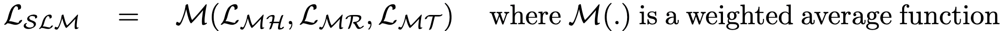

For the pre-training stage, we have taken 80K images and their scene graphs from the original Visual Genome dataset and trained using the *MEP* setup explained in the [pre-training methodology](../../Methodology/Pre-training) section. We have a total of 2,315,906 triples from these scene graphs. The objective that is trained on is 

 

During the pre-training as mentioned, we are masking each of the head object, relation and tail object independently and trying to estimate the masked object. Here are the loss curves for the three types of losses and the combined loss which is stated as above. 

 

 

The accuracy values for the three heads are 

 

