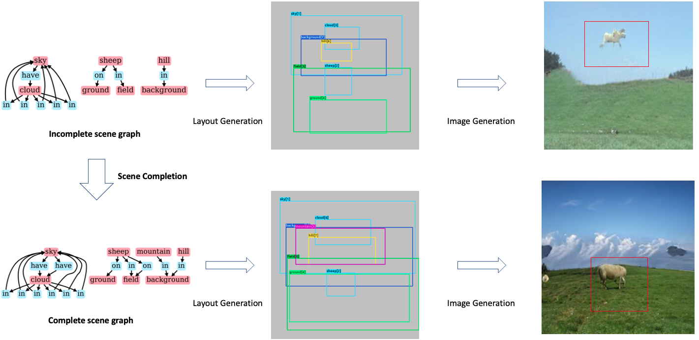
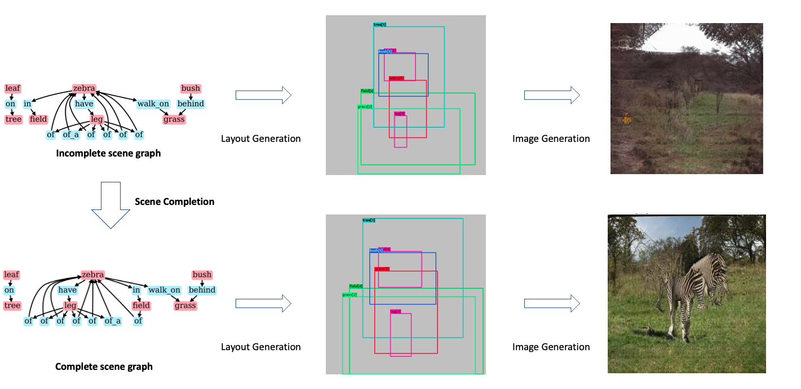
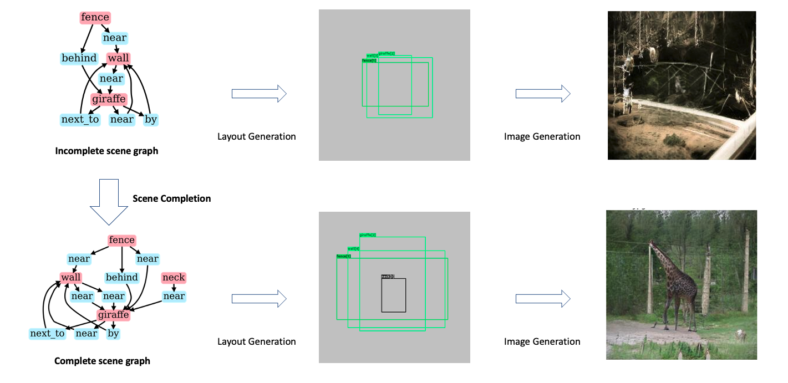
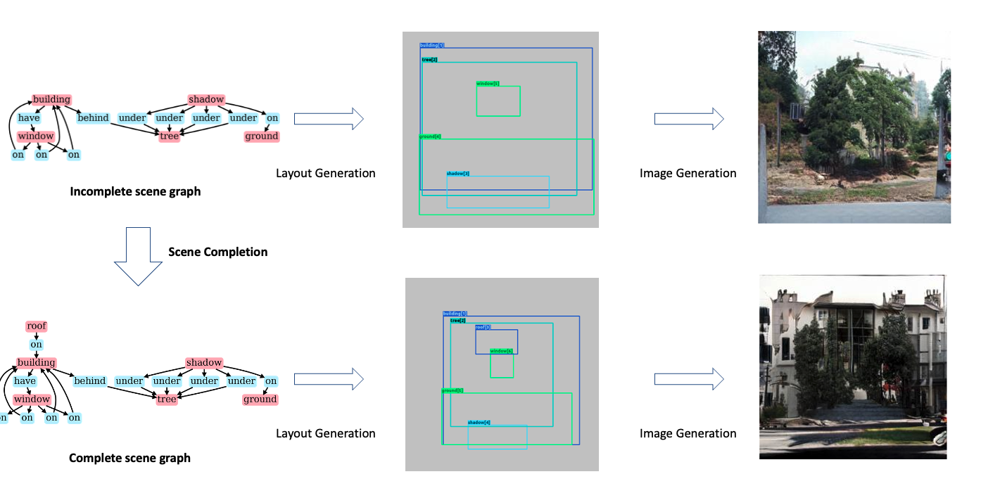
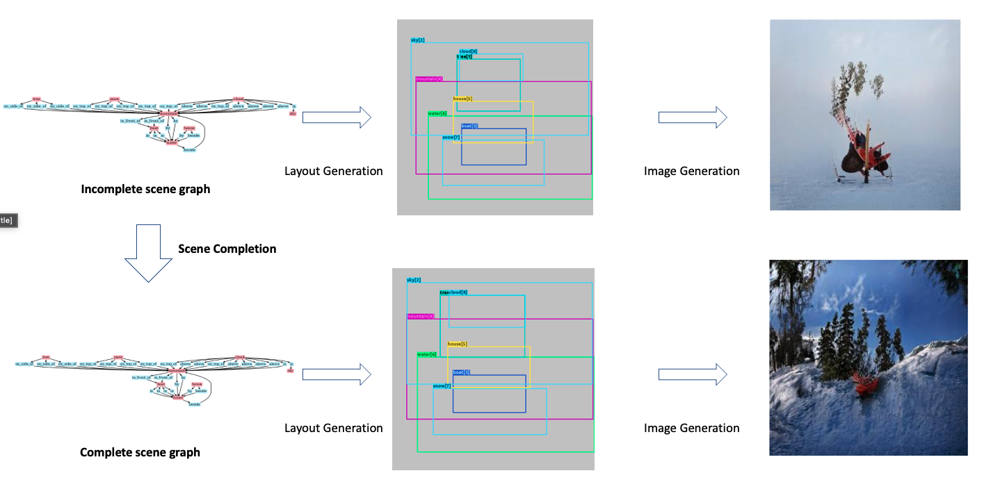
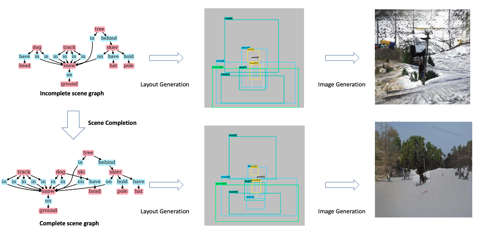
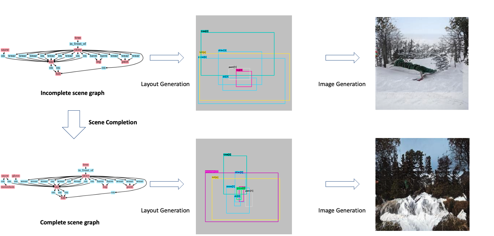
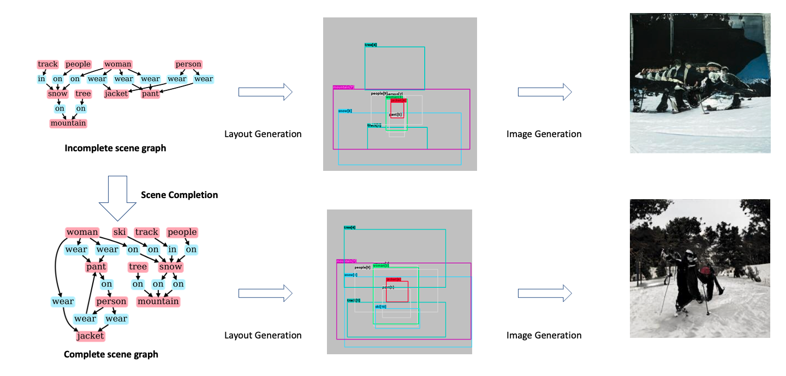
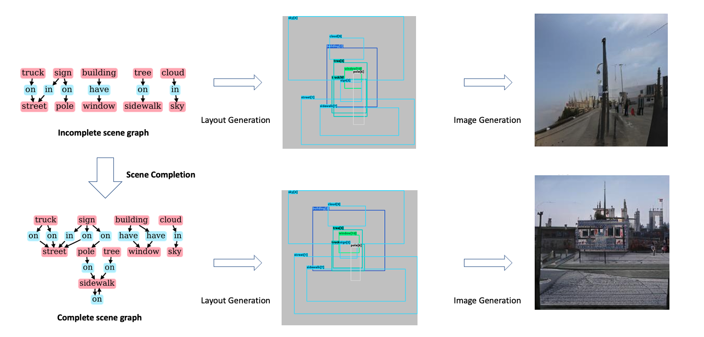
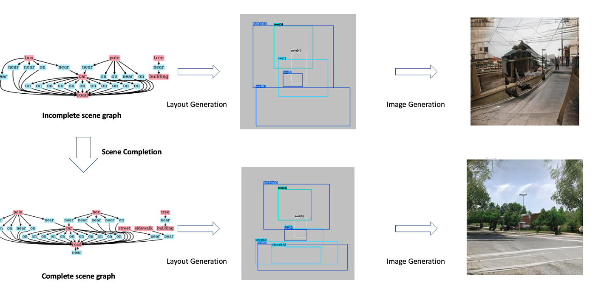

In this page, we will look into some of the qualitiative results of the images generated from the proposed pipe line 

In each example, the top row corresponds to the missing scene graph and the bottom row corresponds to the auto completed scene graph. For each case, we show the generated layouts and the final image. To reiterate the definitions of the missing and predicted scene graphs are as follows

- **Missing SG**:
    In this setup, we mask random relations and tail objects of the triplets in the scene graph. This masked scene graph is passed through the layout generation module and the resulting layout is used for generating the final image.

- **Predicted SG**:
    In this setup, we predict the missing relations and objects using our proposed method. This completed scene graph is then used for subsequent layout and image generation.

> Higher Resolution output images can be found [here](https://docs.google.com/presentation/d/1nIssxJSznZk_rvQmyX_a8fjxLDEFGAaoP8_rlZvwp-4/edit?usp=sharing)

Qualitative Example 1   

Qualitative Example 2   

Qualitative Example 3   

Qualitative Example 4   

Qualitative Example 5   

Qualitative Example 6   

Qualitative Example 7   

Qualitative Example 8   

Qualitative Example 9  

Qualitative Example 10   

