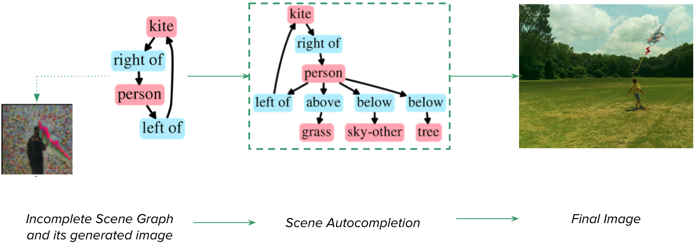
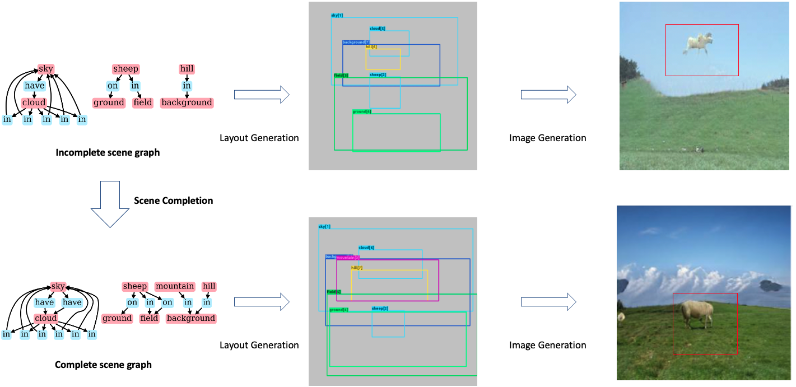

Auto-Scene is a project aimed at auto completing a given scene information towards generating natural looking images, and is part of a course project of 16824 Spring 2022 course. The code can be found at [https://github.com/bhanu77prakash/Auto-Scene-Code](https://github.com/bhanu77prakash/Auto-Scene-Code). The link to this webpage is [https://bhanu77prakash.github.io/scene-edit.github.io/](https://bhanu77prakash.github.io/scene-edit.github.io/).

> Title: Neural Synthesis of Natural Images From Semantically Guided Graphical Representations 

Authors - 
<table style="width:400px;">
<tr><td>Bhanu Prakash</td><td>bguda@cs.cmu.edu</td></tr>
<tr><td>Kunal Dhawan</td><td>kunaldha@cs.cmu.edu</td></tr>
<tr><td>Manoj Ghuhan</td><td>marivazh@cs.cmu.edu</td></tr>
</table>

In this work, we address the novel problem of generating realistic images through scene autocompletion, in which a user can provide the overall concept of the scene with missing objects and relations. Our goal is to minimize the user effort by alleviating them from specifying each and every minute detail of a scene, which is traditionally captured through object relations in form of a graph. Towards this end we propose our model *Neural Synthesis of Natural Images From Semantically Guided Graphical Representations* , wherein we take an incomplete scene graph from the users, and through our multi-staged pipeline, we autocomplete the scene, infer the layout of the scene, and finally generate the image. In short, our goal is to Generate natural looking and coherent images from given (incomplete) scene graph. 

 
Here is an example generated by the proposed pipeline

